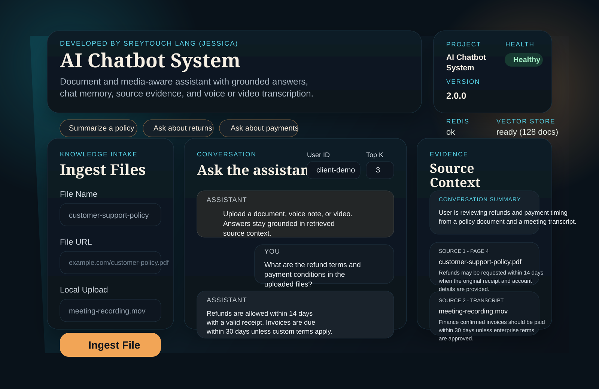
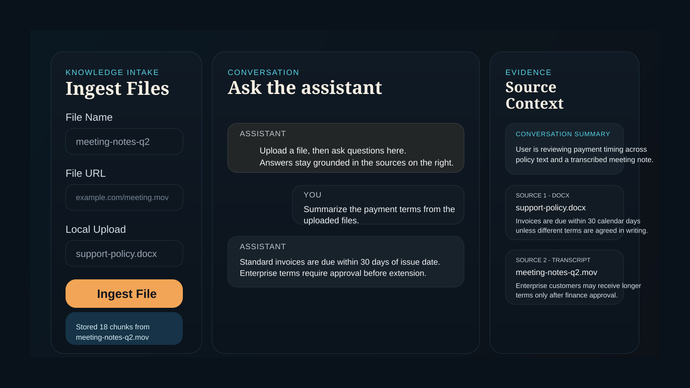

# AI Chatbot System

Document and media-aware chatbot built with a polished frontend plus a FastAPI, LangGraph, Redis, and Chroma backend.

Developed by **Sreytouch Lang (Jessica)**.

## UI Preview

<p align="center">
  
</p>

<p align="center">
  
</p>

## Highlights

- branded project identity and API metadata
- custom frontend at `/` with ingest, chat, health, summary, and evidence panels
- safer startup checks with no dummy vector data inserted
- centralized configuration for cleaner maintenance
- stronger request validation and typed API responses
- user-based chat sessions instead of a hardcoded user id
- chat responses now include answer, summary, and source snippets
- local or URL-based document, voice, and video ingestion with duplicate detection, cleanup, transcription, and timeouts
- audio and video transcription powered by OpenAI, with `ffmpeg` conversion for compatible media formats
- `/health` and `/about` endpoints for service visibility
- `.env.example` added for easier setup

## Client Experience

- one-page dashboard with a branded landing section and live service status
- flexible ingestion from URL or local upload for PDF, DOCX, audio, and video
- conversational chat experience with persistent user sessions
- evidence sidebar that shows retrieved source snippets for every answer
- rolling conversation summary so longer sessions stay easier to follow
- responsive layout that still presents well on smaller screens

## Backend Features

- FastAPI service layer with typed request and response schemas
- LangGraph workflow for memory loading, retrieval, answer generation, summarization, and storage
- Redis-backed chat memory with recent-message windows and rolling summaries
- Chroma vector storage for retrieval-augmented answers
- hash-based duplicate detection to avoid re-ingesting the same file content
- document parsing for PDF and DOCX plus media transcription for voice and video
- startup health checks and operational endpoints for visibility

## Tech Stack

- FastAPI
- LangGraph
- Redis
- ChromaDB
- OpenAI APIs for chat, embeddings, and transcription
- HTML, CSS, and vanilla JavaScript frontend

## Architecture

```text
Client
  -> FastAPI controllers
  -> service layer
  -> LangGraph workflow
      -> load memory from Redis
      -> retrieve context from Chroma
      -> generate answer with LLM
      -> summarize conversation
      -> store memory in Redis
```

## Project Structure

```text
AI-Chatbot-System/
|-- controllers/     # FastAPI route handlers
|-- core/            # settings and app-level exceptions
|-- db/              # Redis and Chroma helpers
|-- graph/           # LangGraph state and nodes
|-- ingest/          # document and media ingestion pipeline
|-- schemas/         # request and response models
|-- services/        # chat, ingest, and health orchestration
|-- utils/           # model and embedding adapters
|-- .env.example     # sample configuration
`-- main.py          # FastAPI app entrypoint
```

## Requirements

- Python 3.10+
- Redis
- OpenAI API key or another supported LLM provider
- `ffmpeg` for some audio/video conversion paths

## Install

```bash
pip install -r requirements.txt
```

## Environment

Start from the sample config:

```bash
cp .env.example .env
```

Key branding defaults:

```bash
APP_NAME=AI Chatbot System
DEVELOPER_DISPLAY_NAME=Sreytouch Lang (Jessica)
```

Minimum API setup:

```bash
OPENAI_API_KEY=your_api_key
```

Transcription defaults for audio and video:

```bash
TRANSCRIPTION_PROVIDER=openai
TRANSCRIPTION_MODEL=gpt-4o-mini-transcribe
```

## Run

```bash
uvicorn main:app --reload
```

App:

```text
http://127.0.0.1:8000
```

API docs:

```text
http://127.0.0.1:8000/docs
```

## Supported Files

- documents: `.pdf`, `.docx`
- audio: `.mp3`, `.m4a`, `.wav`, `.ogg`, `.flac`, `.mpeg`, `.mpga`
- convertible audio: `.aac`, `.aif`, `.aiff`, `.caf`, `.wma`
- video: `.mp4`, `.mov`, `.m4v`, `.avi`, `.mkv`, `.webm`

## API

### `GET /`

Serves the frontend dashboard UI.

### `GET /about`

Returns branded project metadata.

### `GET /api/info`

Returns the app name, version, and developer credit as JSON.

### `GET /health`

Checks Redis and vector store readiness.

### `POST /api/ingest`

Ingest a remote supported file into the vector store.

Request:

```json
{
  "file_name": "terms_conditions",
  "source_url": "https://example.com/terms.pdf"
}
```

`source_url` also accepts the legacy key `s3_url`.

Supported file types are listed above in **Supported Files**.

### `POST /api/ingest/upload`

Upload a local supported document, audio, or video file directly from the UI or with multipart form data.

Example:

```bash
curl -X POST "http://127.0.0.1:8000/api/ingest/upload" \
  -F "file=@/path/to/meeting.mov" \
  -F "file_name=meeting_notes"
```

### `POST /api/chat`

Ask a question using memory plus retrieved document context.

Request:

```json
{
  "user_id": "customer-42",
  "q": "What is the return policy?",
  "top_k": 3
}
```

Response shape:

```json
{
  "status": "success",
  "data": {
    "user_id": "customer-42",
    "answer": "You can return items within 30 days...",
    "summary": "Customer is asking about returns and refunds.",
    "sources": [
      {
        "source_file": "terms_conditions",
        "page_number": 2,
        "excerpt": "Returns are accepted within 30 days..."
      }
    ]
  }
}
```

## Notes

- If the uploaded files do not contain the answer, the assistant is instructed to say that clearly instead of inventing facts.
- Conversation history is stored in Redis with both recent messages and a rolling summary.
- Duplicate ingestion is detected by file hash.
- Audio and video ingestion rely on transcription, so a valid `OPENAI_API_KEY` is required for those file types.
- Some media formats are converted with `ffmpeg` before transcription.
- The visible project branding now credits **Sreytouch Lang (Jessica)** by default.
